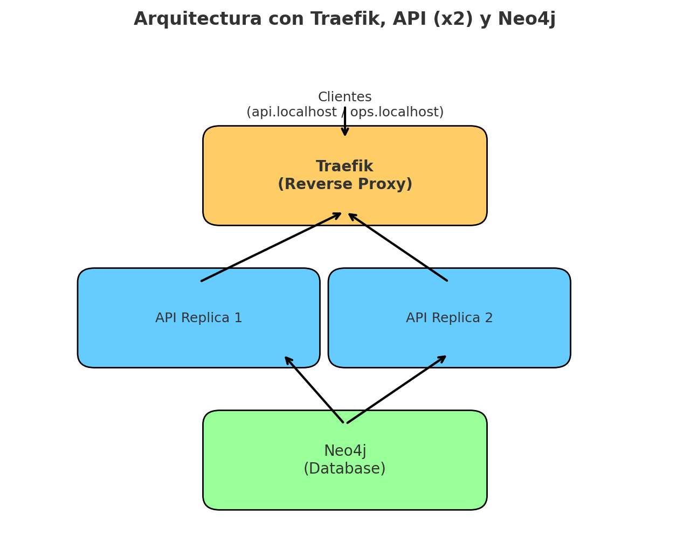

# Gateway de servicios con Traefik

Este proyecto implementa un **reverse proxy con Traefik** para exponer una API Node.js conectada a **Neo4j**, asegurando balanceo de carga, middlewares de seguridad y un dashboard de monitoreo protegido con autenticación básica.

---

## 📌 Topología

- **Clientes** acceden vía:
  - `http://api.localhost` → API.
  - `http://ops.localhost/dashboard/` → dashboard Traefik (requiere credenciales).
- **Traefik** funciona como reverse proxy y balanceador.
- **API** (2 réplicas) desarrollada en Node.js + Express.
- **Neo4j** como base de datos, accesible solo desde la red Docker.

---

## 📂 Estructura del proyecto

traefik-project/
├─ docker-compose.yml
├─ api/
│ ├─ Dockerfile
│ ├─ package.json
│ └─ index.js
└─ diagram.png

## ⚙️ Hosts configurados

En `/etc/hosts` se agregaron:
127.0.0.1 api.localhost
127.0.0.1 ops.localhost

## Pruebas

Se encuentran en la carpeta evidencias

## Análisis
Traefik frente a mapear puertos directamente:
Traefik permite centralizar el acceso a varios servicios sin necesidad de exponer y recordar diferentes puertos manualmente. Con Traefik se pueden usar dominios como api.localhost o ops.localhost y además ofrece balanceo de carga, certificados SSL y middlewares, cosas que no se tienen simplemente mapeando puertos en Docker.

Middlewares que usaría en producción:
Usaría autenticación básica o JWT para proteger servicios internos, rate limiting para evitar abuso de la API, circuit breakers y reintentos para mejorar la resiliencia, compresión para reducir el tamaño de las respuestas y redirección a HTTPS para mayor seguridad. Estos middlewares ayudan en seguridad, estabilidad y rendimiento.

Riesgos del dashboard abierto y cómo mitigarlos:
Si el dashboard queda abierto cualquier persona puede ver información sensible de los servicios y la configuración, lo que facilita ataques. Para evitarlo se recomienda proteger con autenticación, restringir el acceso por IP o VPN, y en producción deshabilitar el dashboard si no es necesario.

